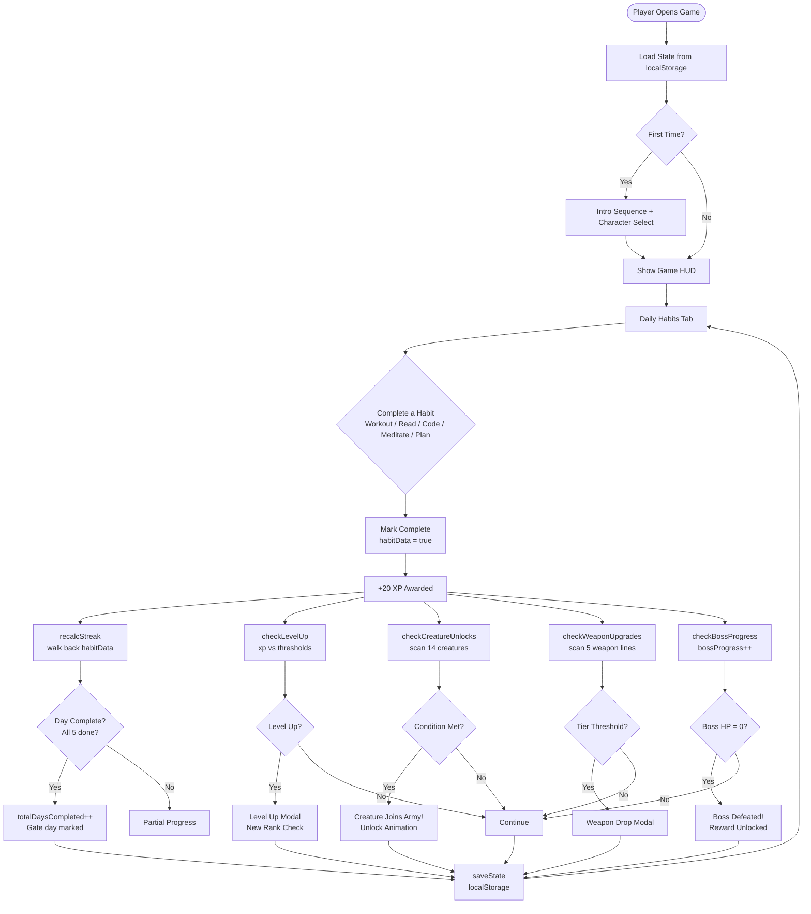
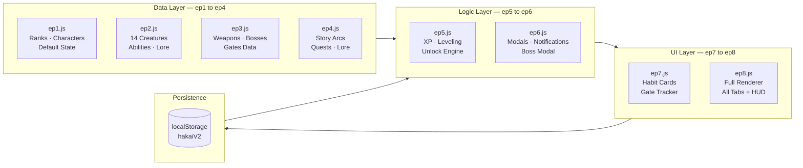
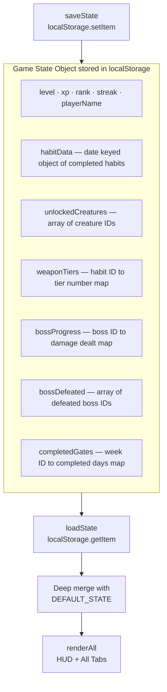

<div align="center">

```
██╗  ██╗ █████╗ ██╗  ██╗ █████╗ ██╗    ██████╗ ██████╗  ██████╗ ████████╗ ██████╗  ██████╗ ██████╗ ██╗
██║  ██║██╔══██╗██║ ██╔╝██╔══██╗██║    ██╔══██╗██╔══██╗██╔═══██╗╚══██╔══╝██╔═══██╗██╔════╝██╔═══██╗██║
███████║███████║█████╔╝ ███████║██║    ██████╔╝██████╔╝██║   ██║   ██║   ██║   ██║██║     ██║   ██║██║
██╔══██║██╔══██║██╔═██╗ ██╔══██║██║    ██╔═══╝ ██╔══██╗██║   ██║   ██║   ██║   ██║██║     ██║   ██║██║
██║  ██║██║  ██║██║  ██╗██║  ██║██║    ██║     ██║  ██║╚██████╔╝   ██║   ╚██████╔╝╚██████╗╚██████╔╝███████╗
╚═╝  ╚═╝╚═╝  ╚═╝╚═╝  ╚═╝╚═╝  ╚═╝╚═╝    ╚═╝     ╚═╝  ╚═╝ ╚═════╝    ╚═╝    ╚═════╝  ╚═════╝ ╚═════╝ ╚══════╝
```

### V 2.0 — HUNTER SYSTEM

*A real-life RPG where your habits are your power*


</div>

---

## ⚡ What Is This?

**Hakai Protocol** is a dark-fantasy RPG habit tracker built entirely in vanilla HTML/CSS/JavaScript. No frameworks. No backend. No accounts. Just pure browser-side code that turns your daily real-world habits into in-game power.

The concept: every time you work out, read, code, meditate, or plan your day — you gain XP, level up, unlock creatures for your Shadow Army, forge legendary weapons, and fight world bosses. Your discipline is your build.

> *The system does not reward potential. It rewards execution.*

---

## 🛠 Technologies Used

| Layer | Technology | Purpose |
|---|---|---|
| Structure | **HTML5** | Game screens, modals, tab panels |
| Styling | **CSS3** | Animations, glassmorphism, keyframes, CSS variables |
| Logic | **Vanilla JavaScript (ES6+)** | Full game engine — state machine, unlock logic, rendering |
| Persistence | **localStorage** | Save/load game state across sessions, zero server needed |
| Fonts | **Google Fonts** (Orbitron, Rajdhani) | Sci-fi / RPG typography |
| Hosting | **GitHub Pages** | Free static deployment, live on any browser |
| Art | **AI-generated PNGs** | 27 unique images — creatures, bosses, weapons, characters |

**Zero dependencies.** No npm. No build step. No React, Vue, or jQuery. Open `index.html` and it runs.

---

## 🏗 Technical Architecture

### Engine Structure

The game engine is split into 8 modular files (concatenated into one `engine.js` at build time):

```
ep1.js  →  Constants & State Schema      (RANKS, CHARACTERS, DEFAULT_STATE)
ep2.js  →  Creature Database             (14 creatures, abilities, unlock conditions)
ep3.js  →  Weapons, Bosses, Gates Data   (5 weapon lines × 5 tiers, 5 bosses)
ep4.js  →  Story & Quest Data            (6 arcs, 30+ quests, lore entries)
ep5.js  →  Game Logic Core               (XP, leveling, unlock checks, streak calc)
ep6.js  →  Modal & Notification System   (creature modal, boss modal, weapon drop)
ep7.js  →  Habit & Gate Rendering        (habit cards, gate weekly tracker)
ep8.js  →  Full UI Renderer              (army, armory, bosses, calendar, HUD)
```

### 🔄 Core Game Loop



---

### 🏗️ Engine Architecture



---

### 🔓 Unlock System

```mermaid
flowchart TD
    H1["WORKOUT"] --> W1["Mjolnir — Tier 3"]
    H1 --> W2["Excalibur — Tier 4"]
    H1 --> W3["Void Sword — Tier 5"]

    H2["READ / LEARN"] --> W4["Staff of Wisdom — Tier 3"]
    H2 --> W5["Demon Staff — Tier 4"]
    H2 --> W6["Neil Bow — Tier 5"]

    H3["BUILD / CODE"] --> W7["Trishul — Tier 3"]
    H3 --> W8["Gauntlets — Tier 4"]

    H4["MEDITATE"] --> W9["Cloak of Shadow — Tier 3"]

    STREAK3["3-Day Streak"] --> C1["Goblin Scout"]
    STREAK7["7-Day Streak"] --> C2["Direwolf Alpha"]
    WORKOUT5["Workout x5"] --> C3["Pack Wolf"]
    DAYS30["30 Full Days"] --> C4["Lizardman Shaman"]
    DAYS75["75 Full Days"] --> C5["Elder Direwolf"]
    GATE3["3x Full Gate Clear"] --> C6["Cryptid Stalker"]
    LV11["Level 11"] --> C7["Hobgoblin Warchief"]
    LV41["Level 41"] --> C8["Elven Shadowblade"]
    LV61["Level 61"] --> C9["Vampire Lord"]
    LV81["Level 81"] --> C10["Archangel of Ruin"]
    LV96["Level 96"] --> C11["Void Cryptid"]
    FLOOR15["Ascension Floor 15"] --> C12["Insectoid General"]
    FLOOR20["Ascension Floor 20"] --> C13["Demon Knight"]
    FLOOR25["Ascension Floor 25"] --> C14["Primordial Demon"]
```



---

### 👹 Boss Progression

```mermaid
flowchart LR
    START(["E-RANK
Level 1"]) --> B1

    B1["THE RIFT CRAWLER
Level 20 · 15 HP
The gap between potential and action"]
    B1 -->|Defeated| B2

    B2["BONE WARLORD KRAGATH
Level 40 · 30 HP
The weight of past failures"]
    B2 -->|Defeated| B3

    B3["SERPENT QUEEN NYX
Level 60 · 50 HP
Ancient judgment — are you worthy?"]
    B3 -->|Defeated| B4

    B4["THE VOID TITAN
Level 80 · 70 HP
Entropy — the pull of doing nothing"]
    B4 -->|Defeated| B5

    B5["THE PROTOCOL ITSELF
Level 100 · 100 HP
The final boss is the system watching you"]
    B5 -->|Defeated| END

    END(["SSS-RANK
System Origin
Transcendence"])

    style B1 fill:#3b0764,stroke:#9333ea,color:#e9d5ff
    style B2 fill:#450a0a,stroke:#ef4444,color:#fee2e2
    style B3 fill:#451a03,stroke:#f59e0b,color:#fef3c7
    style B4 fill:#2e1065,stroke:#8b5cf6,color:#ede9fe
    style B5 fill:#052e16,stroke:#22c55e,color:#dcfce7
    style END fill:#1c1917,stroke:#fbbf24,color:#fef3c7
```



---

### 💾 State Architecture



### CSS Architecture

```
style.css (414 lines base)  +  css_add.css (modular additions)
    │
    ├── CSS Custom Properties (--bg-dark, --cyan, --blue-glow...)
    ├── Glassmorphism panels (backdrop-filter: blur)
    ├── Orbitron + Rajdhani font stack
    ├── Creature card system (portrait art + stat layout)
    ├── Weapon tier slot system
    ├── Epic boss card system (per-boss theme colors)
    ├── Creature modal (Ken Burns zoom, scan line, entrance anim)
    ├── Boss modal (full-art, color-matched border glow)
    └── 15+ @keyframe animations
```

---

## 📖 The Story

### World Lore

The world has changed. **Rifts** — dimensional tears in reality — have begun appearing across the globe. From them emerge creatures of increasing power, drawn to human potential the way predators are drawn to weakness.

The **Hakai Protocol** is the System's response. A hunter classification framework that identifies individuals with the capacity to grow, assigns them a rank, and tracks their evolution. You are one of these individuals.

You didn't choose this. The System chose you.

### Story Arcs

The game tells its story through **6 narrative arcs**, delivered as you level up and complete quests:

| Arc | Unlocks At | Theme |
|---|---|---|
| **The Awakening** | Level 1 | You are identified. The System initialises. Your first steps as a hunter. |
| **Resistance** | Level 10 | The world pushes back. Comfort is the first enemy. |
| **The Mechanism** | Level 25 | You start to understand the system is not random — it is testing you. |
| **Deep Systems** | Level 50 | The bosses are not obstacles. They are reflections. |
| **The Protocol** | Level 80 | The final enemy isn't a creature. It's the version of you that stopped. |
| **Transcendence** | Level 96 | Beyond rank. Beyond system. What comes after you've won? |

### The Bosses as Story Beats

Each world boss represents a real psychological obstacle:

```
LV 20 — THE RIFT CRAWLER     "The gap between potential and action"
         A dimensional parasite that nests in your excuses.
         Defeated by: closing the gap. Showing up anyway.

LV 40 — BONE WARLORD KRAGATH  "The weight of past failures"
         An undead general who tests if you're worthy of what you're building.
         Defeated by: consistency under pressure.

LV 60 — SERPENT QUEEN NYX     "Ancient judgment — are you worthy?"
         A primordial deity who doesn't attack. She evaluates.
         Defeated by: sustaining a 5-day streak.

LV 80 — THE VOID TITAN        "Entropy — the pull of doing nothing"
         A colossal entity made of compressed negative space.
         Defeated by: generating enough positive force to outweigh it.

LV 100 — THE PROTOCOL ITSELF  "The final boss is the system watching you"
          At the pinnacle, there is no external enemy.
          Defeated by: becoming the person who reaches level 100.
```

---

## 🎮 How to Play

### Core Loop

Every day, complete your real-world habits in the **HABITS** tab. Each completion:
- Awards **XP**
- Maintains your **streak**
- Deals **1 damage** to the active boss
- Progresses **unlock conditions** for creatures and weapons

### The 5 Habits

| Habit | Weapon Line | What counts |
|---|---|---|
| ⚔️ **WORKOUT** | Mjolnir → Excalibur → Void Sword | Any physical training |
| 📚 **READ / LEARN** | Staff of Wisdom → Demon Staff → Neil Bow | Books, courses, study |
| 💻 **BUILD / CODE** | Trishul → Gauntlets | Building, coding, creating |
| 🧘 **MEDITATE** | Cloak of Shadow | Mindfulness, stillness |
| 📋 **PLAN THE DAY** | Neil Bow → Demon Staff | Daily planning, strategy |

### Ranking System

| Rank | Level | Title |
|---|---|---|
| E | 1–10 | Shadow Initiate |
| D | 11–25 | Awakened Hunter |
| C | 26–40 | Field Hunter |
| B | 41–60 | Elite Hunter |
| A | 61–80 | Master Hunter |
| S | 81–95 | Shadow Monarch |
| SS | 96–100 | Transcendent |
| SSS | 101+ | System Origin |

### Shadow Army — 14 Creatures Across 7 Tiers

Build your army by completing real objectives:

```
E-RANK  Goblin Scout        →  Maintain a 3-day streak
E-RANK  Pack Wolf           →  Complete WORKOUT 5 times
D-RANK  Hobgoblin Warchief  →  Reach Level 11
D-RANK  Direwolf Alpha      →  Maintain a 7-day streak
C-RANK  Lizardman Shaman    →  Complete 30 full days
C-RANK  Cryptid Stalker     →  Achieve 3 full 7/7 Gate Clears
B-RANK  Insectoid General   →  Unlock Ascension Floor 15
B-RANK  Elven Shadowblade   →  Reach Level 41
A-RANK  Vampire Lord        →  Reach Level 61
A-RANK  Demon Knight        →  Unlock Ascension Floor 20
S-RANK  Archangel of Ruin   →  Reach Level 81
S-RANK  Primordial Demon    →  Unlock Ascension Floor 25
SS-RANK Elder Direwolf      →  Complete 75 full days
SS-RANK Void Cryptid        →  Reach Level 96
```

### Gates — Weekly Missions

Each week has a **Gate** with 7 daily objectives. Complete all 7 to achieve a **Full Gate Clear** — the hardest unlock condition in the game.

### Armory — Weapon Progression

Every habit has a weapon line that upgrades as you complete more reps:

```
Tier 1 → Tier 2 → Tier 3 → Tier 4 → Tier 5
                  (image)  (image)  (image)   ← Art unlocks from Tier 3
```

---

## 🚀 Play the Game

<div align="center">

| | Link | Description |
|---|---|---|
| 🎮 | **[PLAY NOW — Browser](https://jeevan-0508.github.io/hakai-protocol-v2)** | Instant play, no install. Progress saves in your browser. |
| ⚙️ | **[DEV / SANDBOX MODE](https://jeevan-0508.github.io/hakai-protocol-v2/dev/)** | Unlock everything, set level, test all features. |
| ⬇️ | **[DOWNLOAD ZIP](https://github.com/Jeevan-0508/hakai-protocol-v2/archive/refs/heads/main.zip)** | Play offline. Extract → run `HAKAI DEV MODE.bat` (Windows) or `python3 -m http.server 8888` (Mac/Linux). |

</div>

---

### 💾 Download & Play Offline

<div align="center">

[](https://github.com/Jeevan-0508/hakai-protocol-v2/archive/refs/heads/main.zip)

**[⬇️ Click here to download the latest version](https://github.com/Jeevan-0508/hakai-protocol-v2/archive/refs/heads/main.zip)**

</div>

#### After downloading:

**Windows (easiest — one double-click):**
1. Download the ZIP above → Extract it
2. Double-click **`HAKAI DEV MODE.bat`** inside the folder
3. It starts a local server and opens the game automatically in your browser

**Mac / Linux:**
1. Download the ZIP → Extract it
2. Open Terminal inside the folder and run:
```bash
python3 -m http.server 8888
```
3. Open **http://localhost:8888** in your browser

**Any device (alternative):**
```bash
# Node.js
npx serve .

# Python 2
python -m SimpleHTTPServer 8888
```

> **Why not just open `index.html` directly?**
> Some browsers block local file requests (fonts, images) when opened via `file://`. Running a local server (any of the above) avoids this entirely.

---

## 📁 Project Structure

```
hakai-protocol-v2/
├── index.html              # Main game shell (all screens + modals)
├── engine.js               # Full game engine (concatenated from ep1–ep8)
├── style.css               # All styles (base + modular additions)
├── dev_panel.js            # Developer sandbox overlay
├── dev/
│   └── index.html          # Dev mode activator (sets session flag → redirects)
│
├── # ── CREATURE ART (14 images) ──
├── goblin_scout.png        archangel.png
├── pack_wolf.png           primordial_demon.png
├── hobgoblin_chief.png     elder_direwolf.png
├── direwolf_alpha.png      void_cryptid.png
├── lizardman_shaman.png    elven_shadowblade.png
├── cryptid_stalker.png     vampire_lord.png
├── insectoid_general.png   demon_knight.png
│
├── # ── BOSS ART (5 images) ──
├── boss_rift_crawler.png   boss_void_titan.png
├── boss_kragath.png        boss_protocol.png
├── boss_nyx.png
│
├── # ── WEAPON ART (9 images) ──
├── mjolnir.png   excalibur.png   void_sword.png
├── staff_of_wisdom.png   demon_staff.png   neil_bow.png
├── trishul.png   gauntlets.png   cloak_of_shadow.png
│
└── # ── CHARACTERS + BACKGROUNDS ──
    striker_jk.png   cath_gems.png
    hakai_world.png  Hakaiworld-2.png
```

---

## 🧠 Design Philosophy

> "The system does not reward potential. It rewards execution."

Hakai Protocol is built on one idea: **gamification only works when the real-world action is the actual requirement**. You cannot fake a streak. You cannot buy XP. The only input is what you actually did today.

The RPG wrapper — the creatures, the weapons, the boss fights — exists to make the feedback loop feel earned. Defeating the Void Titan at level 80 should feel like something, because reaching level 80 means you actually showed up, consistently, for months.

---

<div align="center">

*Built by Jeevan · Hakai Protocol V2 · Hunter System*

**[▶ PLAY NOW](https://jeevan-0508.github.io/hakai-protocol-v2)** &nbsp;|&nbsp; **[⚙ DEV MODE](https://jeevan-0508.github.io/hakai-protocol-v2/dev/)**

</div>
